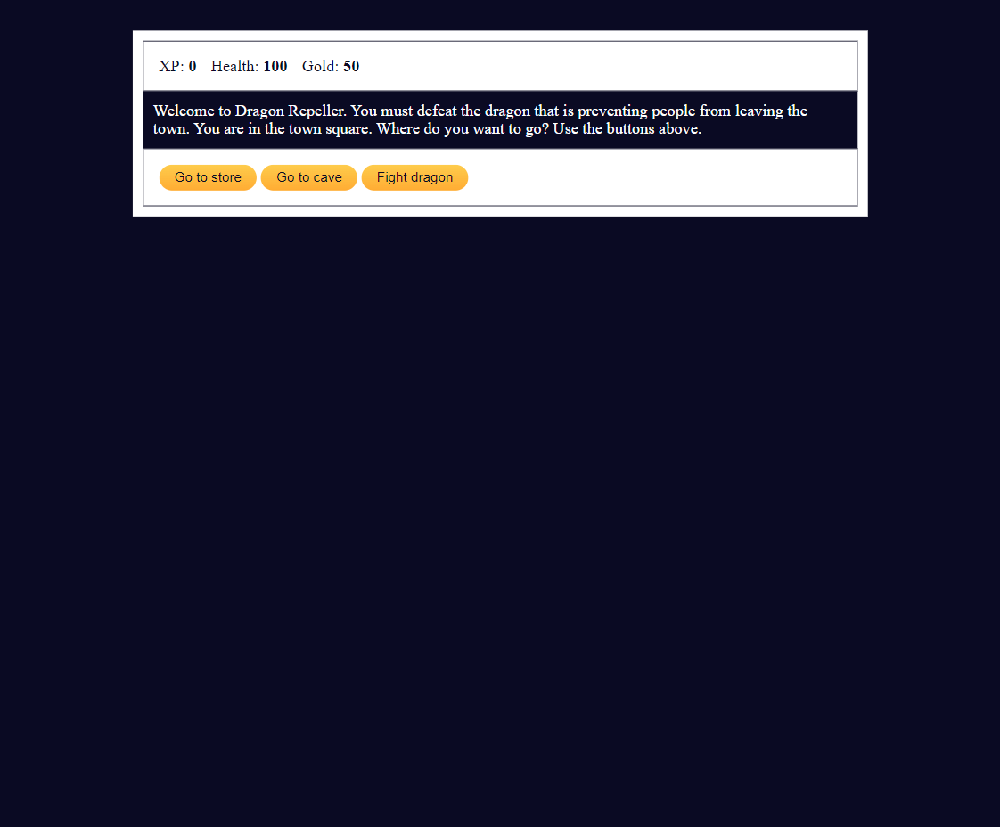

# FreeCodeCamp - Role Playing Game

Projet done to learn fundamental programming concepts in JavaScript by coding a Role Playing Game. 
I've review how to work with arrays, strings, objects, functions, loops, if/else statements, and more.

## Table of contents

- [Screenshot](#screenshot)
- [Links](#links)
- [Author](#author)

### Screenshot

### Links

- Challenge: [Role Playing Game](https://www.freecodecamp.org/learn/javascript-algorithms-and-data-structures-v8/#learn-basic-javascript-by-building-a-role-playing-game)
- [Live Site URL](https://mariecourse.github.io/role-game/)

## Author

Maria Carrera

